# CIFAR-10 Classification using Convolutional Neural Networks (CNN)

## 1. Objective

The objective of this project is to develop a Convolutional Neural Network (CNN) to classify the 10 types of objects in the CIFAR-10 dataset.

## 2. Motivation

The CIFAR-10 dataset is another rich and labelled dataset used for benchmarking machine and deep learning image classification algorithms. It contains 60,000 images of typical objects such as animals, vehicles, airplanes, etc. 

In this section, we shall demonstrate how to develop convolutional neural network for clothing items classification from scratch, using the CIFAR-10dataset, including:
* How to prepare the input training and test data 
* How to deploy the model
* How to use the trained model to make predictions
* How to evaluate its performance

## 3. Data

A high-level description of the CIFAR-10 dataset is as follows:
* It contains 60000 color images, with size 32x32 pixels, 
* The objects in the images are in the following10 classes:
  * Airplane
  * Automobile
  * Bird
  * Cat
  * Deer
  * Dog
  * Frog
  * Horse
  * Ship
  * Truck.
* It has 6000 images per class:
  * There are 50000 training images
  * There are 10000 test images.
* Sample images from the CIFAR-10 data set are illustrated in the next figure:
  * There are significant variations between the different types of classes
  * There are significant variations as well as similarities between different examples of the same class.
  * Additional information about the CIFAR-10 dataset can be found in [1].
  
  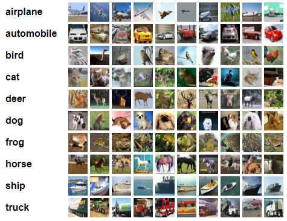
  
## 4. Development

In this section, we shall demonstrate how to develop a Convolutional Neural Network (CNN) for clothing-articles classification from scratch, including:

# How to prepare the input training and test data 
# How to deploy the model
* How to use the trained model to make predictions
* How to evaluate its performance

* Author: Mohsen Ghazel (mghazel)
( Date: April 6th, 2021

* Project: CIFAR-10 Classification using Convolutional Neural Networks (CNN):

The objective of this project is to demonstrate how to develop a Convolutional Neural Network (CNN) to classify images from 10 different typical object classes, using the CIFAR-10 dataset:

* A high-level description of the CIFAR-10 dataset is as follows:

  * It contains 60000 color images, with size 32x32 pixels,
    * The objects in the images are in the following10 classes:
      * Airplane
      * Automobile
      * Bird
      * Cat
      * Deer
      * Dog
      * Frog
      * Horse
      * Ship
      * Truck.
  * It has 6000 images per class.
    * There are 50000 training images
    * There are 10000 test images
    * Additional detailed about the Fashion can be found here:
     * https://www.cs.toronto.edu/~kriz/cifar.html
     
* The CNN model training and evaluation process incvolves the following steps:
  1. Load the CIFAR-10 dataset of handwritten digits
  2. Build a simple CNN model
  3. Train the selected ML model
  4. Deploy the trained on the test data
  5. Evaluate the performance of the trained model using evaluation metrics:
     * Accuracy
     * Confusion Matrix
     * Other metrics derived form the confusion matrix.

### 4.1. Part 1: Imports and global variables:

#### 4.1.1. Standard scientific Python imports:

<pre style="color:#000000;bbackground:#e6ffff;font-size:10px;line-height:1.5;"># Numpy
import numpy as np
# matplotlib
import matplotlib.pyplot as plt
# - import sklearn to use the confusion matrix function
from sklearn.metrics import confusion_matrix
# import itertools
import itertools
# opencv
import cv2
# tensorflow
import tensorflow as tf

# keras input layer
from tensorflow.keras.layers import Input
# keras conv2D layer
from tensorflow.keras.layers import Conv2D
# keras MaxPooling2D layer
from tensorflow.keras.layers import MaxPooling2D
# keras Dense layer
from tensorflow.keras.layers import Dense
# keras Flatten layer
from tensorflow.keras.layers import Flatten
# keras Dropout layer
from tensorflow.keras.layers import Dropout
# batch-normalization
from tensorflow.keras.layers import BatchNormalization
# global-max-pooling
from tensorflow.keras.layers import GlobalMaxPooling2D

# keras model
from tensorflow.keras.models import Model
# keras sequential model
from tensorflow.keras.models import Sequential
# optimizers
from tensorflow.keras.optimizers import SGD

# random number generators values
# seed for reproducing the random number generation
from random import seed
# random integers: I(0,M)
from random import randint
# random standard unform: U(0,1)
from random import random
# time
import datetime
# I/O
import os
# sys
import sys

# check for successful package imports and versions
# python
print("Python version : {0} ".format(sys.version))
# OpenCV
print("OpenCV version : {0} ".format(cv2.__version__))
# numpy
print("Numpy version  : {0}".format(np.__version__))
# tensorflow
print("Tensorflow version  : {0}".format(tf.__version__))

Python version : 3.7.10 (default, Feb 20 2021, 21:17:23) 
[GCC 7.5.0] 
OpenCV version : 4.1.2 
Numpy version  : 1.19.5
Tensorflow version  : 2.4.1
</pre>

#### 4.1.2. Global variables:

<pre style="color:#000000;background:#e6ffff;font-size:10px;line-height:1.5;"># -set the random_state seed = 100 for reproducibilty
random_state_seed = 100

# the number of visualized images
num_visualized_images = 25
</pre>

### 4.2. Part 2: Load CIFAR-10 Dataset

#### 4.2.1. Load the CIFAR-10dataset:

* Load the CIFAR-10T dataset of clothing-articles:
  * A high-level description of the CIFAR-10 dataset is as follows:
    * It contains 60000 color images, with size 32x32 pixels,
      * The objects in the images are in the following10 classes:
        * Airplane
        * Automobile
        * Bird
        * Cat
        * Deer
        * Dog
        * Frog
        * Horse
        * Ship
        * Truck.
    * It has 6000 images per class.
      * There are 50000 training images
      * There are 10000 test images
      * Additional detailed about the Fashion can be found here:
       * https://www.cs.toronto.edu/~kriz/cifar.html

<pre style="color:#000000;background:#e6ffff;font-size:10px;line-height:1.5;"># Load in the CIFAR10 data set
# - It has 10 classes
cifar10 = tf.keras.datasets.cifar10
# extract the training and testing subsets
(x_train, y_train), (x_test, y_test) = cifar10.load_data()

Downloading data from https://www.cs.toronto.edu/~kriz/cifar-10-python.tar.gz
170500096/170498071 [==============================] - 2s 0us/step
</pre>

#### 4.2.2. Explore training and test images:

##### 4.2.2.1 Display the number and shape of the training and test subsets:

<pre style="color:#000000;background:#e6ffff;font-size:10px;line-height:1.5;">#------------------------------------------------------
# Training data:
#------------------------------------------------------
# the number of training images
num_train_images = x_train.shape[0]
print("----------------------------------------------")
print("Training data:")
print("----------------------------------------------")
print("x_train.shape: ", x_train.shape)
print("Number of training images: ", num_train_images)
print("Image size: ", x_train.shape[1:])

#------------------------------------------------------
# Test data:
#------------------------------------------------------
# the number of test images
num_test_images = x_test.shape[0]
print("----------------------------------------------")
print("Test data:")
print("----------------------------------------------")
print("x_test.shape: ", x_test.shape)
print("Number of test images: ", num_test_images)
print("Image size: ", x_test.shape[1:])
print("----------------------------------------------")

----------------------------------------------
Training data:
----------------------------------------------
x_train.shape:  (50000, 32, 32, 3)
Number of training images:  50000
Image size:  (32, 32, 3)
----------------------------------------------
Test data:
----------------------------------------------
x_test.shape:  (10000, 32, 32, 3)
Number of test images:  10000
Image size:  (32, 32, 3)
----------------------------------------------
</pre>

##### 4.2.2.2. Reshape the training and test target vectors:

* Convert the y_train and y_test to 1-dimensional vectors:

<pre style="color:#000000;background:#e6ffff;font-size:10px;line-height:1.5;"># flatten the y_train targets vector to convert to 1-dimensional
y_train = y_train.flatten()

# flatten the y_test targets to convert to 1-dimensional
y_test = y_test.flatten()
</pre>

##### 4.2.2.3. Display the targets/classes:

* There 10 classes:
  * Each training and test example is assigned to one of the following labels:

###### 4.2.2.3.1. Display the number of classes:

<pre style="color:#000000;background:#e6ffff;font-size:10px;line-height:1.5;"># Display the number of classes:
num_classes = len(set(y_train))
print('-------------------------------------------------')
print("The number of classes in the CIFAR dataset = ", num_classes)
print('-------------------------------------------------')

-------------------------------------------------
The number of classes in the CIFAR dataset =  10
-------------------------------------------------
</pre>

###### 4.2.2.3.2. Create meaningful labels for the different classes:

<pre style="color:#000000;background:#e6ffff;font-size:10px;line-height:1.5;"># the labels mapping
labels = '''airplane
automobile
bird
cat
deer
dog
frog
horse
ship
truck'''.split()
# display the class labels
for counter in range(num_classes):
  print('Class ID = {}, Class name = {}'.format(counter, labels[counter]))

Class ID = 0, Class name = airplane
Class ID = 1, Class name = automobile
Class ID = 2, Class name = bird
Class ID = 3, Class name = cat
Class ID = 4, Class name = deer
Class ID = 5, Class name = dog
Class ID = 6, Class name = frog
Class ID = 7, Class name = horse
Class ID = 8, Class name = ship
Class ID = 9, Class name = truck
</pre>

##### 4.2.2.4. Examine the number of images for each class of the training and testing subsets:

<pre style="color:#000000;background:#e6ffff;font-size:10px;line-height:1.5;"># Create a histogram of the number of images in each class/digit:
def plot_bar(y, loc='left', relative=True):
    width = 0.35
    if loc == 'left':
        n = -0.5
    elif loc == 'right':
        n = 0.5
     
    # calculate counts per type and sort, to ensure their order
    unique, counts = np.unique(y, return_counts=True)
    sorted_index = np.argsort(unique)
    unique = unique[sorted_index]
     
    if relative:
        # plot as a percentage
        counts = 100*counts[sorted_index]/len(y)
        ylabel_text = '% count'
    else:
        # plot counts
        counts = counts[sorted_index]
        ylabel_text = 'count'
         
    xtemp = np.arange(len(unique))
    plt.bar(xtemp + n*width, counts, align='center', alpha=.7, width=width)
    plt.xticks(xtemp, unique, rotation=45)
    plt.xlabel('digit')
    plt.ylabel(ylabel_text)
 
plt.suptitle('Frequency of images per digit')
plot_bar(y_train, loc='left')
plot_bar(y_test, loc='right')
plt.legend([
    'train ({0} images)'.format(len(y_train)), 
    'test ({0} images)'.format(len(y_test)), 
]);
</pre>

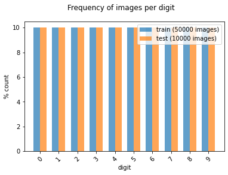

##### 4.2.2.5. Visualize some of the training and test images and their associated targets:

* First implement a visualization functionality to visualize the number of randomly selected images:

<pre style="color:#000000;background:#e6ffff;font-size:10px;line-height:1.5;">"""
# A utility function to visualize multiple images:
"""
def visualize_images_and_labels(num_visualized_images = 25, dataset_flag = 1):
  """To visualize images.

&nbsp;&nbsp;&nbsp;&nbsp;&nbsp;&nbsp;Keyword arguments:
&nbsp;&nbsp;&nbsp;&nbsp;&nbsp;&nbsp;&nbsp;&nbsp;&nbsp;- num_visualized_images -- the number of visualized images (deafult 25)
&nbsp;&nbsp;&nbsp;&nbsp;&nbsp;&nbsp;&nbsp;&nbsp;&nbsp;- dataset_flag -- 1: training dataset, 2: test dataset
&nbsp;&nbsp;&nbsp;&nbsp;&nbsp;&nbsp;Return:
&nbsp;&nbsp;&nbsp;&nbsp;&nbsp;&nbsp;&nbsp;&nbsp;&nbsp;- None
&nbsp;&nbsp;"""
  #--------------------------------------------
  # the suplot grid shape:
  #--------------------------------------------
  num_rows = 5
  # the number of columns
  num_cols = num_visualized_images // num_rows
  # setup the subplots axes
  fig, axes = plt.subplots(nrows=num_rows, ncols=num_cols, figsize=(8, 10))
  # set a seed random number generator for reproducible results
  seed(random_state_seed)
  # iterate over the sub-plots
  for row in range(num_rows):
      for col in range(num_cols):
        # get the next figure axis
        ax = axes[row, col];
        # turn-off subplot axis
        ax.set_axis_off()
        #--------------------------------------------
        # if the dataset_flag = 1: Training data set
        #--------------------------------------------
        if ( dataset_flag == 1 ): 
          # generate a random image counter
          counter = randint(0,num_train_images)
          # get the training image
          image = np.squeeze(x_train[counter,:])
          # get the target associated with the image
          label = labels[y_train[counter]]
        #--------------------------------------------
        # dataset_flag = 2: Test data set
        #--------------------------------------------
        else: 
          # generate a random image counter
          counter = randint(0,num_test_images)
          # get the test image
          image = np.squeeze(x_test[counter,:])
          # get the target associated with the image
          label = labels[y_test[counter]]
        #--------------------------------------------
        # display the image
        #--------------------------------------------
        ax.imshow(image, cmap=plt.cm.gray_r, interpolation='nearest')
        # set the title showing the image label
        ax.set_title(str(label), size = 8)
</pre>

##### 4.2.2.5.1. Visualize some of the training images and their associated targets:

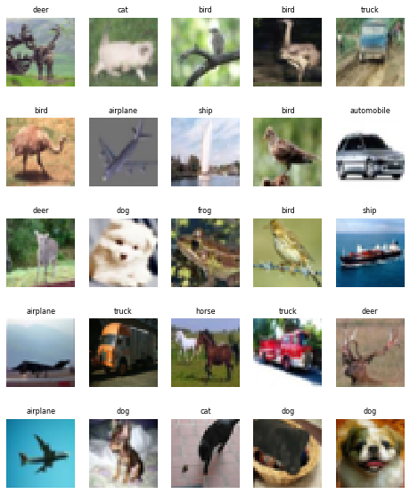

##### 4.2.2.5.2. Visualize some of the test images and their associated targets:

<pre style="color:#000000;background:#e6ffff;font-size:10px;line-height:1.5;"># call the function to visualize the training images
visualize_images_and_labels(num_visualized_images, 1)
</pre>

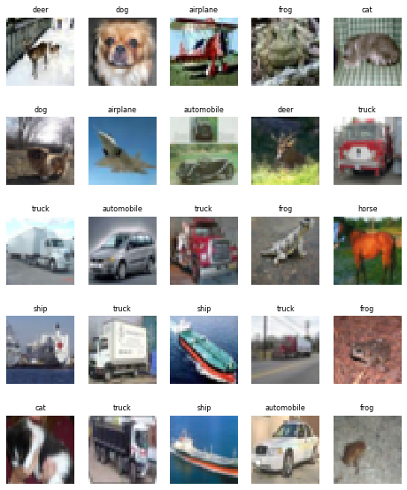

#### 4.2.3. Normalize the training and test images to the interval: [0, 1]:

<pre style="color:#000000;background:#e6ffff;font-size:10px;line-height:1.5;"># Normalize the training images
x_train = x_train / 255.0
# Normalize the test images
x_test = x_test / 255.0
</pre>

### 4.3. Part 3: Build the CNN model architecture

#### 4.3.1. Design the structure of the CNN model to classify the CIFAR-10 images:

<pre style="color:#000000;background:#e6ffff;font-size:10px;line-height:1.5;">#-------------------------------------------------------------------------------
# Build the sequential CNN model
#-------------------------------------------------------------------------------
# Build the model using the functional API
#-------------------------------------------------------------------------------
# Layer # 1: Input layer
#-------------------------------------------------------------------------------
# - input images size: (28, 28, 3)
#-------------------------------------------------------------------------------
i = Input(shape=x_train[0].shape)   
#-------------------------------------------------------------------------------
# Layer # 2: Convolutional layer
#-------------------------------------------------------------------------------
# - 32 filters:  
#   - size: 3x3
#   - same
#   - stride = 1 
# - Activation function: relu
#------------------------------------------------------------------------------- 
x = Conv2D(32, (3, 3), activation='relu', padding='same')(i) 
#-------------------------------------------------------------------------------
# Layer # 3: Batch normalization
#-------------------------------------------------------------------------------              
x = BatchNormalization()(x)   
#-------------------------------------------------------------------------------
# Layer # 4: Convolutional layer
#-------------------------------------------------------------------------------
# - 32 filters:  
#   - size: 3x3
#   - same
#   - stride = 1 
# - Activation function: relu
#------------------------------------------------------------------------------- 
x = Conv2D(32, (3, 3), activation='relu', padding='same')(x) 
#-------------------------------------------------------------------------------
# Layer # 5: Batch normalization
#-------------------------------------------------------------------------------              
x = BatchNormalization()(x)  
#-------------------------------------------------------------------------------
# Layer # 6: Max-pooling layer
#-------------------------------------------------------------------------------
# - Max-pooling  
#   - size: 2x2
#------------------------------------------------------------------------------- 
x = MaxPooling2D((2, 2))(x)   
#-------------------------------------------------------------------------------
# Layer # 7: Convolutional layer
#-------------------------------------------------------------------------------
# - 32 filters:  
#   - size: 3x3
#   - same
#   - stride = 1 
# - Activation function: relu
#------------------------------------------------------------------------------- 
x = Conv2D(64, (3, 3), activation='relu', padding='same')(x) 
#-------------------------------------------------------------------------------
# Layer # 8: Batch normalization
#-------------------------------------------------------------------------------   
x = BatchNormalization()(x)                                     
#-------------------------------------------------------------------------------
# Layer # 9: Convolutional layer
#-------------------------------------------------------------------------------
# - 64 filters:  
#   - size: 3x3
#   - same
#   - stride = 1 
# - Activation function: relu
#------------------------------------------------------------------------------- 
x = Conv2D(64, (3, 3), activation='relu', padding='same')(x)   
#-------------------------------------------------------------------------------
# Layer # 10: Batch normalization
#-------------------------------------------------------------------------------    
x = BatchNormalization()(x)        
#-------------------------------------------------------------------------------
# Layer # 11: Max-pooling layer
#-------------------------------------------------------------------------------
# - Max-pooling  
#   - size: 2x2
#------------------------------------------------------------------------------- 
x = MaxPooling2D((2, 2))(x)                               
#-------------------------------------------------------------------------------
# Layer # 12: Convolutional layer
#-------------------------------------------------------------------------------
# - 128 filters:  
#   - size: 3x3
#   - same
#   - stride = 1 
# - Activation function: relu
#------------------------------------------------------------------------------- 
x = Conv2D(128, (3, 3), activation='relu', padding='same')(x)  
#-------------------------------------------------------------------------------
# Layer # 13: Batch normalization
#-------------------------------------------------------------------------------    
x = BatchNormalization()(x)  
#-------------------------------------------------------------------------------
# Layer # 14: Convolutional layer
#-------------------------------------------------------------------------------
# - 128 filters:  
#   - size: 3x3
#   - same
#   - stride = 1 
# - Activation function: relu
#------------------------------------------------------------------------------- 
x = Conv2D(128, (3, 3), activation='relu', padding='same')(x)   
#-------------------------------------------------------------------------------
# Layer # 15: Batch normalization
#------------------------------------------------------------------------------- 
x = BatchNormalization()(x)    
#-------------------------------------------------------------------------------
# Layer # 16: Max-pooling layer
#-------------------------------------------------------------------------------
# - Max-pooling  
#   - size: 2x2
#------------------------------------------------------------------------------- 
x = MaxPooling2D((2, 2))(x)        
#-------------------------------------------------------------------------------
# Layer # 17: Flatten
#-------------------------------------------------------------------------------
# - Flatten to connect to the next Fully-Connected Dense layer
#------------------------------------------------------------------------------- 
x = Flatten()(x)       
#-------------------------------------------------------------------------------
# Layer # 18: Dropout layer
#-------------------------------------------------------------------------------
# - p = 0.20  
#-------------------------------------------------------------------------------                                         
x = Dropout(0.2)(x)      
#-------------------------------------------------------------------------------
# Layer # 19: Dense layer
#-------------------------------------------------------------------------------
# - 1024 neurons
# - Activation function: relu
#-------------------------------------------------------------------------------                                    
x = Dense(1024, activation='relu')(x)    
#-------------------------------------------------------------------------------
# Layer # 20: Dropout layer
#-------------------------------------------------------------------------------
# - p = 0.20  
#-------------------------------------------------------------------------------                        
x = Dropout(0.2)(x)      
#-------------------------------------------------------------------------------
# Layer # 21: Output layer
#-------------------------------------------------------------------------------
# - Number of neurons: num_classes 
# - Activation function: softmax:
# - Suitable for multi-class classification.
#-------------------------------------------------------------------------------                                       
x = Dense(num_classes, activation='softmax')(x)                         
#-------------------------------------------------------------------------------          
# Create the model with above structure:
#-------------------------------------------------------------------------------
model = Model(i, x)
</pre>

#### 4.3.2. Print the designed model summary:

<pre style="color:#000000;background:#e6ffff;font-size:10px;line-height:1.5;">Model: "model"
_________________________________________________________________
Layer (type)                 Output Shape              Param #   
=================================================================
input_1 (InputLayer)         [(None, 32, 32, 3)]       0         
_________________________________________________________________
conv2d (Conv2D)              (None, 32, 32, 32)        896       
_________________________________________________________________
batch_normalization (BatchNo (None, 32, 32, 32)        128       
_________________________________________________________________
conv2d_1 (Conv2D)            (None, 32, 32, 32)        9248      
_________________________________________________________________
batch_normalization_1 (Batch (None, 32, 32, 32)        128       
_________________________________________________________________
max_pooling2d (MaxPooling2D) (None, 16, 16, 32)        0         
_________________________________________________________________
conv2d_2 (Conv2D)            (None, 16, 16, 64)        18496     
_________________________________________________________________
batch_normalization_2 (Batch (None, 16, 16, 64)        256       
_________________________________________________________________
conv2d_3 (Conv2D)            (None, 16, 16, 64)        36928     
_________________________________________________________________
batch_normalization_3 (Batch (None, 16, 16, 64)        256       
_________________________________________________________________
max_pooling2d_1 (MaxPooling2 (None, 8, 8, 64)          0         
_________________________________________________________________
conv2d_4 (Conv2D)            (None, 8, 8, 128)         73856     
_________________________________________________________________
batch_normalization_4 (Batch (None, 8, 8, 128)         512       
_________________________________________________________________
conv2d_5 (Conv2D)            (None, 8, 8, 128)         147584    
_________________________________________________________________
batch_normalization_5 (Batch (None, 8, 8, 128)         512       
_________________________________________________________________
max_pooling2d_2 (MaxPooling2 (None, 4, 4, 128)         0         
_________________________________________________________________
flatten (Flatten)            (None, 2048)              0         
_________________________________________________________________
dropout (Dropout)            (None, 2048)              0         
_________________________________________________________________
dense (Dense)                (None, 1024)              2098176   
_________________________________________________________________
dropout_1 (Dropout)          (None, 1024)              0         
_________________________________________________________________
dense_1 (Dense)              (None, 10)                10250     
=================================================================
Total params: 2,397,226
Trainable params: 2,396,330
Non-trainable params: 896
_________________________________________________________________
</pre>

### 4.4. Part 4: Compile the CNN model

* Compile the CNN model, developed above:

<pre style="color:#000000;background:#e6ffff;font-size:10px;line-height:1.5;">#-------------------------------------------------------------------------------
# Compile the model
#-------------------------------------------------------------------------------
model.compile(optimizer='adam',                       # optimzer: adam
              loss='sparse_categorical_crossentropy', # used for multi-class models
              metrics=['accuracy'])                   # performance evaluation metric
</pre>

### 4.5. Part 5: Train/Fit the model:

* Start training the compiled CNN model.

<pre style="color:#000000;background:#e6ffff;font-size:10px;line-height:1.5;">#-------------------------------------------------------------------------------
# Fit the model:
#-------------------------------------------------------------------------------
# - set the number of epochs
num_epochs = 100
# train the model
r = model.fit(x_train, y_train, validation_data=(x_test, y_test), epochs=num_epochs) metric

Epoch 1/100
1563/1563 [===] - 44s 7ms/step - loss: 1.7406 - accuracy: 0.4430 - val_loss: 1.1168 - val_accuracy: 0.6064
Epoch 2/100
1563/1563 [===] - 10s 6ms/step - loss: 0.8931 - accuracy: 0.6859 - val_loss: 1.0089 - val_accuracy: 0.6618
Epoch 3/100
1563/1563 [===] - 10s 6ms/step - loss: 0.7057 - accuracy: 0.7548 - val_loss: 0.8089 - val_accuracy: 0.7254
Epoch 4/100
1563/1563 [===] - 10s 6ms/step - loss: 0.5802 - accuracy: 0.7983 - val_loss: 0.6552 - val_accuracy: 0.7797
Epoch 5/100
1563/1563 [===] - 10s 6ms/step - loss: 0.4876 - accuracy: 0.8325 - val_loss: 0.6397 - val_accuracy: 0.7898
..........................................................................................................
..........................................................................................................
Epoch 95/100
1563/1563 [===] - 10s 7ms/step - loss: 0.0244 - accuracy: 0.9923 - val_loss: 1.1665 - val_accuracy: 0.8421
Epoch 96/100
1563/1563 [===] - 10s 7ms/step - loss: 0.0284 - accuracy: 0.9921 - val_loss: 0.9971 - val_accuracy: 0.8495
Epoch 97/100
1563/1563 [===] - 10s 7ms/step - loss: 0.0233 - accuracy: 0.9937 - val_loss: 1.1636 - val_accuracy: 0.8468
Epoch 98/100
1563/1563 [===] - 10s 7ms/step - loss: 0.0276 - accuracy: 0.9920 - val_loss: 1.0155 - val_accuracy: 0.8474
Epoch 99/100
1563/1563 [===] - 10s 7ms/step - loss: 0.0303 - accuracy: 0.9913 - val_loss: 1.1582 - val_accuracy: 0.8414
Epoch 100/100
1563/1563 [===] - 10s 7ms/step - loss: 0.0273 - accuracy: 0.9922 - val_loss: 1.1399 - val_accuracy: 0.8398
</pre>

### 4.6. Part 6: Evaluate the model

* Evaluate the trained CNN model on the test data using different evaluation metrics:
  * Loss function
  * Accuracy
  * Confusion matrix.

### 4.6.1. Loss function:

* Display the variations of the training and validation loss function with the number of epochs:

<pre style="color:#000000;background:#e6ffff;font-size:10px;line-height:1.5;"># Plot loss per iteration
import matplotlib.pyplot as plt
plt.plot(result.history['loss'], label='loss')
plt.plot(result.history['val_loss'], label='val_loss');
plt.legend();
plt.xlabel('Epoch Iteration');
plt.ylabel('Loss');
</pre>

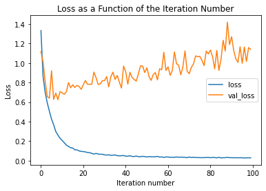

#### 4.6.3. Accuracy:

* Display the variations of the training and validation accuracy with the number of epochs:

<pre style="color:#000000;background:#e6ffff;font-size:10px;line-height:1.5;"># Plot accuracy per iteration
plt.plot(result.history['accuracy'], label='acc');
plt.plot(result.history['val_accuracy'], label='val_acc');
plt.legend();
plt.xlabel('Epoch Iteration');
plt.ylabel('Accuracy');
</pre>

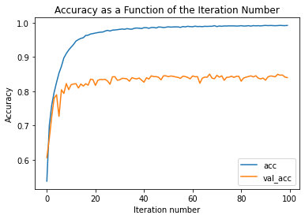

#### 4.6.3. Compute the test-data Accuracy:

* Compute and display the accuracy on the test-data:

<pre style="color:#000000;background:#e6ffff;font-size:10px;line-height:1.5;"># Compute the model accuracy on the test data
accuracy_test_data = model.evaluate(x_test, y_test)
# display the atest-data accuracy
print('-------------------------------------------------------')
print('The test-data accuracy = ' + str(accuracy_test_data[1]))
print('-------------------------------------------------------')

313/313 [==============================] - 1s 3ms/step - loss: 1.1399 - accuracy: 0.8398
-------------------------------------------------------
The test-data accuracy = 0.8398000001907349
-------------------------------------------------------
</pre>

#### 4.6.4. Confusion Matrix Visualizations:

* Compute the confusion matrix:

<pre style="color:#000000;background:#e6ffff;font-size:10px;line-height:1.5;">#-------------------------------------------------------------------------------
# Compute the confusion matrix
#-------------------------------------------------------------------------------
def plot_confusion_matrix(cm, classes,
                          normalize=False,
                          title='Confusion matrix',
                          cmap=plt.cm.Blues):
  """
&nbsp;&nbsp;This function prints and plots the confusion matrix.
&nbsp;&nbsp;Normalization can be applied by setting `normalize=True`.
&nbsp;&nbsp;"""
  if normalize:
      cm = cm.astype('float') / cm.sum(axis=1)[:, np.newaxis]
      print("Normalized confusion matrix")
  else:
      print('Confusion matrix, without normalization')

  # Display the confusuon matrix
  print(cm)
  # display the confusion matrix
  plt.imshow(cm, interpolation='nearest', cmap=cmap)
  plt.title(title)
  plt.colorbar()
  tick_marks = np.arange(len(classes))
  plt.xticks(tick_marks, classes, rotation=45)
  plt.yticks(tick_marks, classes)
  
  fmt = '.2f' if normalize else 'd'
  thresh = cm.max() / 2.
  for i, j in itertools.product(range(cm.shape[0]), range(cm.shape[1])):
      plt.text(j, i, format(cm[i, j], fmt),
               horizontalalignment="center",
               color="white" if cm[i, j] &gt; thresh else "black")

  plt.tight_layout()
  plt.ylabel('True label')
  plt.xlabel('Predicted label')
  plt.show()

#-------------------------------------------------------------------------------
# Predict the targets for the test data
#-------------------------------------------------------------------------------
p_test = model.predict(x_test).argmax(axis=1)
# construct the confusion matrix
cm = confusion_matrix(y_test, p_test)
# plot the confusion matrix
plot_confusion_matrix(cm, list(range(10)), 
                      False, 
                      'Confusion matrix', 
                      plt.cm.Greens)
</pre>

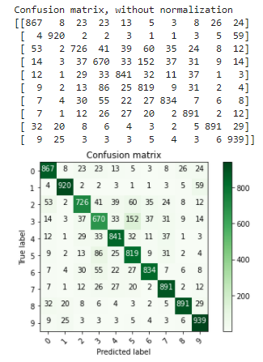

#### 4.6.5) Examine some of the misclassified digits:

* Display some of the misclassified digit:

<pre style="color:#000000;background:#e6ffff;font-size:10px;line-height:1.5;"># - Find the indices of all the mis-classified examples
misclassified_idx = np.where(p_test != y_test)[0] # select the index
# setup the subplot grid for the visualized images
 # the suplot grid shape
num_rows = 5
# the number of columns
num_cols = num_visualized_images // num_rows
# setup the subplots axes
fig, axes = plt.subplots(nrows=num_rows, ncols=num_cols, figsize=(12, 8))
# set a seed random number generator for reproducible results
seed(random_state_seed)
# iterate over the sub-plots
for row in range(num_rows):
  for col in range(num_cols):
    # get the next figure axis
    ax = axes[row, col];
    # turn-off subplot axis
    ax.set_axis_off()
    # select a random mis-classified example
    counter = np.random.choice(misclassified_idx)
    # get test image 
    image = np.squeeze(x_test[counter,:])
    # get the true labels of the selected image
    label = labels[y_test[counter]]
    # get the predicted label of the test image
    yhat = labels[p_test[counter]]
    # display the image 
    ax.imshow(image, cmap=plt.cm.gray_r, interpolation='nearest')
    # display the true and predicted labels on the title of tehe image
    ax.set_title('Y = %s, $\hat{Y}$ = %s' % ((label), (yhat)), size = 8)
</pre>

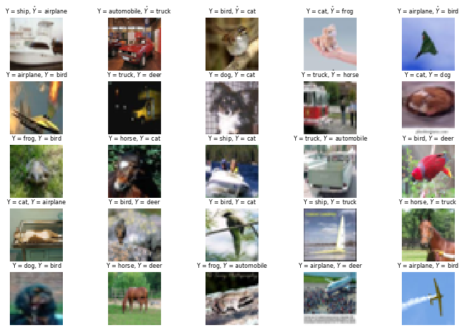

### 4.7. Part 7: Try to improve the model performance using data augmentation:

* The CNN appears to be over-fitting:
  * Excellent performance on the training data
  * Poor performance on the validation data.

* In an attempt to address the over-fitting issue, we apply data augmentation:

  * Data augmentation simply means increasing size of the labelled data so that we provide higher number of training and validation examples:
  * Some of the popular image augmentation techniques are flipping, translation, rotation, scaling, changing brightness, adding noise, etc.
  * Next, we apply data augmentation using the folloing image transformation:
     * Horizontal image shift by 10% or less
     * Vertical image shift by 10% or less
     * Horizontal image flip.

<pre style="color:#000000;background:#e6ffff;font-size:10px;line-height:1.5;">#-------------------------------------------------------------------------------
# 7) Apply data augmentation:
#-------------------------------------------------------------------------------
# Set the batch size
batch_size = 32
#-------------------------------------------------------------------------------
# 7.1) Define the data generator: defines the way the training images are augmented
#-------------------------------------------------------------------------------
# - width_shift_range=0.1
# - height_shift_range=0.1
# - horizontal_flip=True
#-------------------------------------------------------------------------------
data_generator = tf.keras.preprocessing.image.ImageDataGenerator(width_shift_range=0.1, height_shift_range=0.1, horizontal_flip=True)
# data generator
train_generator = data_generator.flow(x_train, y_train, batch_size)
# compute the steps per epochs
steps_per_epoch = x_train.shape[0] // batch_size

#-------------------------------------------------------------------------------
# 7.2) Fit the model using the augmented data
#-------------------------------------------------------------------------------
# Note: if you run this AFTER calling the previous model.fit(), 
#   - It will CONTINUE training where it left off
#-------------------------------------------------------------------------------
#-------------------------------------------------------------------------------
# - set the number of epochs
num_epochs = 100
# train the model
r = model.fit(train_generator, validation_data=(x_test, y_test), 
              steps_per_epoch=steps_per_epoch, 
              epochs=num_epochs)
</pre>

<pre style="color:#000000;background:#ffffff;">Epoch 1/100
1562/1562 [===] - 30s 19ms/step - loss: 0.5678 - accuracy: 0.8228 - val_loss: 0.4802 - val_accuracy: 0.8533
Epoch 2/100
1562/1562 [===] - 29s 19ms/step - loss: 0.4467 - accuracy: 0.8572 - val_loss: 0.4519 - val_accuracy: 0.8543
Epoch 3/100
1562/1562 [===] - 29s 19ms/step - loss: 0.4121 - accuracy: 0.8672 - val_loss: 0.4935 - val_accuracy: 0.8491
Epoch 4/100
1562/1562 [===] - 29s 19ms/step - loss: 0.3962 - accuracy: 0.8713 - val_loss: 0.4293 - val_accuracy: 0.8599
Epoch 5/100
1562/1562 [===] - 30s 19ms/step - loss: 0.3654 - accuracy: 0.8788 - val_loss: 0.4271 - val_accuracy: 0.8633
...........................................................................................................
...........................................................................................................
Epoch 95/100
1562/1562 [===] - 29s 19ms/step - loss: 0.1259 - accuracy: 0.9592 - val_loss: 0.4579 - val_accuracy: 0.8909
Epoch 96/100
1562/1562 [===] - 29s 19ms/step - loss: 0.1273 - accuracy: 0.9586 - val_loss: 0.4829 - val_accuracy: 0.8892
Epoch 97/100
1562/1562 [===] - 29s 19ms/step - loss: 0.1237 - accuracy: 0.9596 - val_loss: 0.4814 - val_accuracy: 0.8857
Epoch 98/100
1562/1562 [===] - 29s 19ms/step - loss: 0.1260 - accuracy: 0.9602 - val_loss: 0.4297 - val_accuracy: 0.8886
Epoch 99/100
1562/1562 [===] - 30s 19ms/step - loss: 0.1239 - accuracy: 0.9589 - val_loss: 0.4830 - val_accuracy: 0.8809
Epoch 100/100
1562/1562 [===] - 30s 19ms/step - loss: 0.1231 - accuracy: 0.9607 - val_loss: 0.4466 - val_accuracy: 0.8912
</pre>

### 4.8. Part 8: Evaluate the re-trained CNN model using data augmentation:

* Evaluate the trained CNN model on the test data using different evaluation metrics:
   * Loss function
   * Accuracy
   * Confusion matrix.

* 4.8.1. Loss function:

  * Display the variations of the training and validation loss function with the number of epochs:

<pre style="color:#000000;background:#e6ffff;font-size:10px;line-height:1.5;"># Plot loss per iteration
import matplotlib.pyplot as plt
plt.plot(r.history['loss'], label='loss');
plt.plot(r.history['val_loss'], label='val_loss');
plt.legend();
plt.xlabel('Iteration number');
plt.ylabel('Loss');
plt.title('Loss as a Function of the Iteration Number');
</pre>

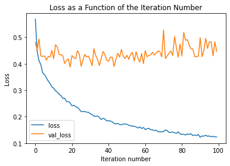

#### 4.8.2. Accuracy:

* Display the variations of the training and validation accuracy with the number of epochs:

<pre style="color:#000000;background:#e6ffff;font-size:10px;line-height:1.5;"># Plot accuracy per iteration
plt.plot(r.history['accuracy'], label='acc');
plt.plot(r.history['val_accuracy'], label='val_acc');
plt.legend();
plt.xlabel('Iteration number');
plt.ylabel('Accuracy');
plt.title('Accuracy as a Function of the Iteration Number');
</pre>

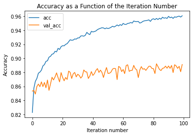

#### 4.8.3. Compute the test-data Accuracy:

* Compute and display the accuracy on the test-data:

<pre style="color:#000000;background:#e6ffff;font-size:10px;line-height:1.5;"># Compute the model accuracy on the test data
accuracy_test_data = model.evaluate(x_test, y_test)
# display the atest-data accuracy
print('-------------------------------------------------------')
print('The test-data accuracy = ' + str(accuracy_test_data[1]))
print('-------------------------------------------------------')
</pre>

<pre style="color:#000000;background:#e6ffff;font-size:10px;line-height:1.5;">313/313 [==============================] - 1s 3ms/step - loss: 0.4466 - accuracy: 0.8912
-------------------------------------------------------
The test-data accuracy = 0.8912000060081482
-------------------------------------------------------
</pre>

#### 4.8.4. Confusion Matrix Visualizations:

* Compute the confusion matrix:

<pre style="color:#000000;background:#e6ffff;font-size:10px;line-height:1.5;"># Plot confusion matrix
from sklearn.metrics import confusion_matrix
import itertools

def plot_confusion_matrix(cm, classes,
                          normalize=False,
                          title='Confusion matrix',
                          cmap=plt.cm.Greens):
  """
&nbsp;&nbsp;This function prints and plots the confusion matrix.
&nbsp;&nbsp;Normalization can be applied by setting `normalize=True`.
&nbsp;&nbsp;"""
  if normalize:
      cm = cm.astype('float') / cm.sum(axis=1)[:, np.newaxis]
      print("Normalized confusion matrix")
  else:
      print('Confusion matrix, without normalization')

  # display the confusion matrix
  print(cm)

  plt.imshow(cm, interpolation='nearest', cmap=cmap)
  plt.title(title)
  plt.colorbar()
  tick_marks = np.arange(len(classes))
  plt.xticks(tick_marks, classes, rotation=45)
  plt.yticks(tick_marks, classes)

  fmt = '.2f' if normalize else 'd'
  thresh = cm.max() / 2.
  for i, j in itertools.product(range(cm.shape[0]), range(cm.shape[1])):
      plt.text(j, i, format(cm[i, j], fmt),
               horizontalalignment="center",
               color="white" if cm[i, j] &gt; thresh else "black")

  plt.tight_layout()
  plt.ylabel('True label')
  plt.xlabel('Predicted label')
  plt.show()

# prediction 
p_test = model.predict(x_test).argmax(axis=1)
# compute confusuon matrix
cm = confusion_matrix(y_test, p_test)
# visualie the confusion matrix
plot_confusion_matrix(cm, list(range(10)))
</pre>

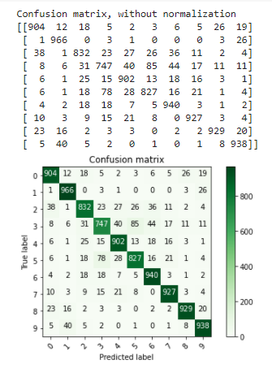

#### 4.8.5. Examine some of the misclassified test-data examples:

* Display some of the misclassified items from the test data:

<pre style="color:#000000;background:#e6ffff;font-size:10px;line-height:1.5;"># - Find the indices of all the mis-classified examples
misclassified_idx = np.where(p_test != y_test)[0] # select the index
# setup the subplot grid for the visualized images
 # the suplot grid shape
num_rows = 5
# the number of columns
num_cols = num_visualized_images // num_rows
# setup the subplots axes
fig, axes = plt.subplots(nrows=num_rows, ncols=num_cols, figsize=(12, 8))
# set a seed random number generator for reproducible results
seed(random_state_seed)
# iterate over the sub-plots
for row in range(num_rows):
  for col in range(num_cols):
    # get the next figure axis
    ax = axes[row, col];
    # turn-off subplot axis
    ax.set_axis_off()
    # select a random mis-classified example
    counter = np.random.choice(misclassified_idx)
    # get test image 
    image = np.squeeze(x_test[counter,:])
    # get the true labels of the selected image
    label = labels[y_test[counter]]
    # get the predicted label of the test image
    yhat = labels[p_test[counter]]
    # display the image 
    ax.imshow(image, cmap=plt.cm.gray_r, interpolation='nearest')
    # display the true and predicted labels on the title of tehe image
    ax.set_title('Y = %s, $\hat{Y}$ = %s' % ((label), (yhat)), size = 8)
</pre>

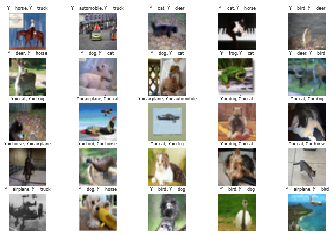

### 4.9. Part 9: Display a final message after successful execution completion

<pre style="color:#000000;background:#e6ffff;font-size:10px;line-height:1.5;"># display a final message
# current time
now = datetime.datetime.now()
# display a message
print('Program executed successfully on: '+ str(now.strftime("%Y-%m-%d %H:%M:%S") + "...Goodbye!\n"))

Program executed successfully on: 2021-04-05 19:42:07...Goodbye!
</pre>

## 5. Analysis

* In view of the presented results, we make the following observations:

   * Before augmentation original designed CNN did not achieves reasonably good classification accuracy on CIFAR-10 dataset:
   * Achieved classification accuracy on the test data = 84%
   * The CNN appears to be over-fitting:
   * Excellent performance on the training data
   * Poor performance on the validation data
   * In an attempt to address the over-fitting issue, we apply data augmentation:
     * Data augmentation simply means increasing size of the labelled data so that we provide higher number of training and validation examples
     * Some of the popular image augmentation techniques are flipping, translation, rotation, scaling, changing brightness, adding noise, etc.
     * We applied data augmentation using the following image transformation:
     * Horizontal image shift by 10% or less
     * Vertical image shift by 10% or less
     * Horizontal image flip.

  * After augmentation the designed CNN achieved much better classification accuracy on CIFAR-10 dataset:
  * Achieved classification accuracy on the test data = 84%

### 4.6. Future Work

* We plan to explore the following related issues:

    * To explore ways of improving the performance of this simple CNN, including fine-tuning the following hyper-parameters:
    * Even after data augmentation, the validation loss function is increasing while the training loss function is decreasing:
      * This indicates over-fitting
      * We shall address this over-fitting by adding dropout and batch normalization layers.
      * We shall also explore fine-tuning some of the hyper-parameters, including:
        * The number of filters and layers
        * The dropout rate
        * The optimizer
        * The learning rate.

### 4.7. References

1. The CIFAR-10 dataset. Retrieved from: https://www.cs.toronto.edu/~kriz/cifar.html (April 6th, 2021). 
2. Park Chansung. CIFAR-10 Image Classification in TensorFlow. Retrieved from: https://towardsdatascience.com/cifar-10-image-classification-in-tensorflow-5b501f7dc77c (April 6th, 2021).
3. Jason Brownlee. How to Develop a CNN From Scratch for CIFAR-10 Photo Classification. Retrieved from: https://machinelearningmastery.com/how-to-develop-a-cnn-from-scratch-for-cifar-10-photo-classification (April 6th, 2021).
4. Tensorflow. Convolutional Neural Network (CNN). Retrieved from: https://www.tensorflow.org/tutorials/images/cnn (April 6th, 2021).
5. Aarya Brahmane.  Deep Learning with CIFAR-10:  Image Classification using CNN. Retrieved from: https://towardsdatascience.com/ (April 6th, 2021).
6. Abhijeet Kumar. Achieving 90% accuracy in Object Recognition Task on CIFAR- Dataset with Keras: Convolutional Neural Networks. Retrieved from: Retrieved from: https://appliedmachinelearning.blog/2018/03/24/achieving-90-accuracy-in-object-recognition-task-on-cifar-10-dataset-with-keras-convolutional-neural-networks/ (April 6th, 2021).
7. Konstantinos Siaterlis. Convolutional NN with Keras Tensorflow on CIFAR-10 Dataset, Image Classification. Retrieved from: https://medium.com/@siakon/convolutional-nn-with-keras-tensorflow-on-cifar-10-dataset-image-classification-d3aad44691bd (April 6th, 2021).
8. Mia Morton. Experimental Process: Completing a Convolutional Neural Network to Classify the CIFAR 10 Dataset. Retrieved from: https://medium.com/@704/experimental-process-in-completing-convolutional-neural-network-to-classify-the-cifar-10-dataset-8de699b82b8d (April 6th, 2021).
9. Kaggle. CIFAR-10 - Object Recognition in Images
Identify the subject of 60,000 labeled images. Retrieved from: https://www.kaggle.com/c/cifar-10/discussion/40237 (April 6th, 2021).
10. Aarya Brahmane. Deep Learning with CIFAR-10. Retrieved from: https://towardsdatascience.com/deep-learning-with-cifar-10-image-classification-64ab92110d79 (April 6th, 2021).
Tensorflow. Convolutional Neural Network (CNN). Retrieved from: https://www.tensorflow.org/tutorials/images/cnn (April 6th, 2021).

